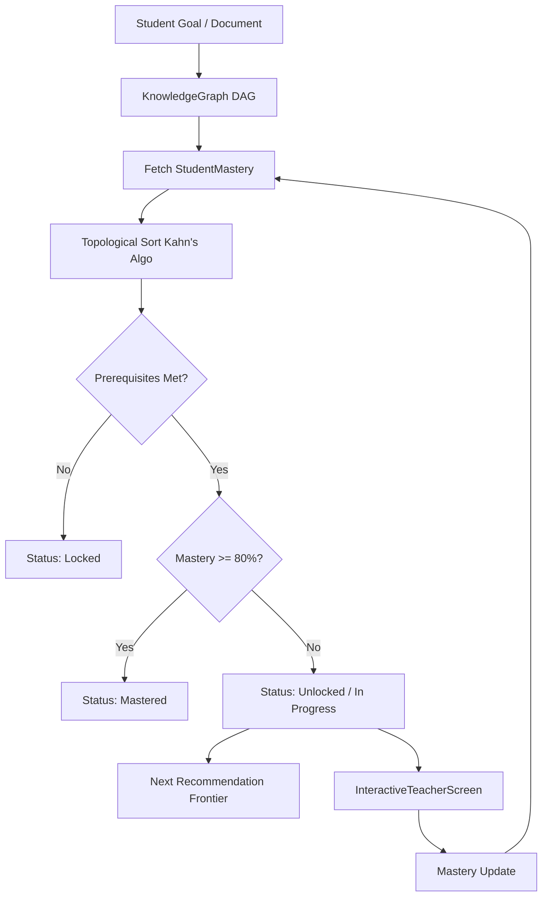

# Knowledge Graph & Intelligent Curriculum Engine Architecture

## 1. Architectural Role & Responsibilities

In accordance with Study Buddy's decoupled learning system principles:

```text
Knowledge Graph
    = What exists and how concepts relate (DAG)

RAG
    = What information exists in the student's resources

Teacher Engine
    = How to teach it (Socratic state machine)

Mastery Model
    = What the student understands (StudentMastery)

Curriculum Engine
    = What the student should learn next (Frontier & Roadmap)

Practice Engine
    = Whether the student can apply it (Quizzes & Exercises)

Revision Engine
    = When the student should see it again (Spaced Repetition SM-2)
```

---

## 2. Directed Acyclic Graph (DAG) Mechanics

The `KnowledgeGraph` engine models concept prerequisite networks as a directed graph where:
- **Node ($u$)**: Represents a conceptual unit (`ConceptNode`: `id`, `title`, `description`, `subject`, `difficulty`, `estimated_mins`, `sub_concepts`, `learning_objectives`).
- **Directed Edge ($u \to v$)**: Declares that concept $u$ is a **prerequisite** for concept $v$ ($u$ must be learned before $v$).

### 2.1 Cycle Detection & Topological Sorting
- **Cycle Detection**: 3-color DFS (White = unvisited, Gray = visiting, Black = visited). Attempts to add backward edges that would create a circular dependency (e.g. $A \to B \to C \to A$) are rejected.
- **Topological Sorting**: Kahn's in-degree algorithm produces a deterministic pedagogical sequence where all prerequisites appear strictly before dependent concepts.

### 2.2 Pedagogical Ordering Example (Operating Systems)
```text
Operating Systems
│
├── Processes
│   ├── Process states
│   ├── PCB
│   └── Context switching
│
├── Threads
│   └── ...
│
├── CPU Scheduling
│   ├── FCFS
│   ├── SJF
│   ├── Round Robin
│   └── Priority Scheduling
│
├── Synchronization
│   ├── Critical section
│   ├── Mutex
│   ├── Semaphore
│   └── Deadlock
│       ├── Mutual exclusion
│       ├── Hold and wait
│       ├── No preemption
│       └── Circular wait
│
└── Memory Management
    ├── Paging
    ├── Segmentation
    └── Virtual memory
```
- **Guaranteed Invariants**:
  - `Processes & Lifecycle` strictly precedes `CPU Scheduling Algorithms`.
  - `Process Synchronization & Concurrency` strictly precedes `Deadlocks & Banker's Algorithm`.
  - `Memory Management & Paging` strictly precedes `Virtual Memory & Page Replacement`.

---

## 3. Curriculum & Roadmap Engine Flow



---

## 4. Key Capabilities

### 4.1 "What Should I Learn Next?"
Locates the highest-priority unlocked, unmastered concept on the curriculum frontier and synthesizes a pedagogical reason based on satisfied prerequisites.

### 4.2 "Why Am I Learning This?"
Generates a structured 4-part rationale:
1. **Conceptual Foundation**: Which mastered prerequisites prepared the student for this topic.
2. **Core Domain Value**: Why this topic is essential.
3. **What It Unlocks**: Which advanced concepts depend on mastering this topic.
4. **Goal Alignment**: How it moves the student toward their target outcome.

### 4.3 100% Offline Integrity
Includes pre-seeded curricula for foundational CS tracks (Operating Systems, DBMS, Machine Learning, Python & DSA) with zero network dependency.
